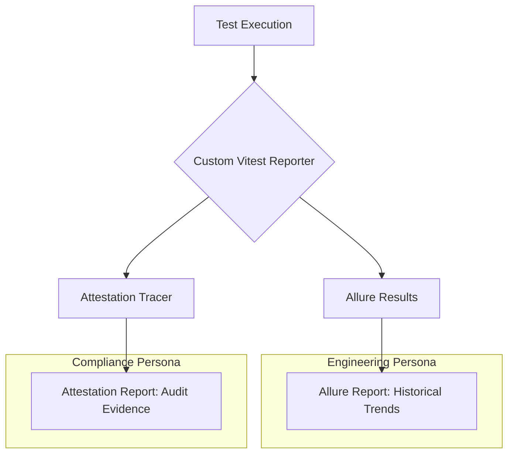

# Reporting Architecture: Dual-Artifact Strategy

This document outlines the design of the reporting system, which converts raw test signals into two distinct artifacts for different stakeholders.

## 🏗 The Architectural Flow

We use a "Single Run, Dual Output" pattern. A single execution of the test suite produces both the compliance evidence and the engineering analytics.



---

## 💎 The Two-Artifact Strategy

Rather than forcing one report type to satisfy all needs, this architecture generates **two complementary artifacts** from the same test run:

| Artifact | Design Target | Primary Use Case |
| :--- | :--- | :--- |
| **Attestation Report** | Regulatory compliance, business rule traceability | Auditors, compliance officers, stakeholders needing proof |
| **Allure Report** | Historical analysis, team collaboration, integration | Developers, QA leads, managers tracking trends |

**This is deliberate architecture**, not a compromise. We don't force executives to parse test logs, and we don't force auditors to navigate interactive dashboards. Each persona gets the format that serves them.

---

## 🛠 How it Works: The "Connective Tissue"

The architecture leverages two native hooks within the Vitest ecosystem:

1.  **Custom Reporter:** Intercepts test results to map them against business rules defined in `pricing-strategy.md`.
2.  **Global Tracer:** A singleton that captures inputs, outputs, and intermediate states during a property-based test run, embedding them as "Evidence Traces" in the final report.

### Running the System

```bash
cd implementations/typescript-vitest
npm install

# Generates both artifacts in one pass
npm test
```

---

## 📄 Artifact 1: Attestation Report (Compliance)

The attestation report is a self-contained HTML file designed for 7-year archival in regulated industries.

**Key Features:**
- **Traceability Matrix:** Every business rule links directly to the tests that verify it.
- **Embedded Traces:** Exact inputs and outputs (e.g., "Cart with 5 items, subtotal $100") are captured for every failure.
- **Zero-Dependency:** Requires no external tools; works offline in any browser.
- **Audit Metadata:** Includes Git SHAs, timestamps, and environment details.

---

## 📊 Artifact 2: Allure Report (Engineering)

The Allure integration is architected for team velocity and CI/CD integration.

**Key Features:**
- **Historical Analysis:** Track test duration and failure trends over time.
- **Flakiness Detection:** Identifies unstable tests that need engineering attention.
- **Enterprise Ready:** Pre-configured for Jira/Xray linking and Slack/Teams notifications.

**Viewing locally:**
```bash
# Requires Java (v11+)
npm run report:allure:generate
npm run report:allure:serve
```

---

## 🏁 When to Use Which Report

| Scenario | Use This Report | Why |
| :--- | :--- | :--- |
| **Audit / Regulatory Review** | Attestation | Traceability to `pricing-strategy.md` is paramount. |
| **Show Executives Progress** | Allure | Visual dashboards and trend lines. |
| **Investigate Test Failure** | Attestation | High-fidelity execution traces show exactly what broke. |
| **Team Velocity Tracking** | Allure | Charts and flakiness detection across builds. |
| **Compliance Evidence** | Attestation | Designed for immutable archival. |